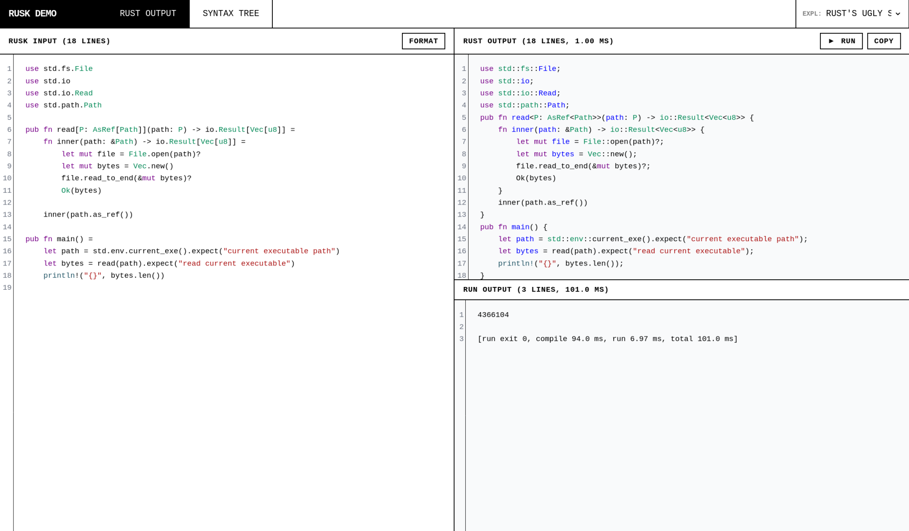

# Rusk



`rusk` is an alternative syntax for [rust](https://rust-lang.org) inspired by the [2023 post rust's ugly syntax ](https://matklad.github.io/2023/01/26/rusts-ugly-syntax.html). `ruk` (`.rk`) is Rust syntax with optional semicolons inferred from function signatures.

## Example

```rsk
#[derive(Debug, Clone)]
pub struct User
    pub id: u64
    pub name: String

impl User
    pub fn new(id: u64, name: String) -> Self = Self{ id, name }
    pub fn display_name(&self) -> &str = &self.name

pub fn main() =
    let user = User.new(1, "Ada".to_string())
    println!("{}", user.display_name())
```

Generated Rust:

```rust
#[derive(Debug, Clone)]
pub struct User {
    pub id: u64,
    pub name: String,
}
impl User {
    pub fn new(id: u64, name: String) -> Self {
        Self{ id, name }
    }
    pub fn display_name(&self) -> &str {
        &self.name
    }
}
pub fn main() {
    let user = User::new(1, "Ada".to_string());
    println!("{}", user.display_name());
}
```

## Usage

```sh
rusk input.rsk -o output.rs
rusk input.rk -o output.rs
rusk transpile input.rsk --source-map output.map.json
rusk from-rust input.rs -o output.rsk
rusk to-ruk input.rs -o output.rk
rusk fmt input.rsk -o input.rsk --line-width 100
cat input.rsk | rusk
rusk run
rusk cargo test
rusk-lsp
just web # open web editor
```

## Supported MVP syntax

- indentation blocks for `struct`, `enum`, `trait`, `impl`, `mod`, `macro_rules!`, `fn`, `if`, `else`, `match`, loops, `unsafe`, and `async`
- optional opening braces on indented blocks, including inline multiline closures
- function bodies with `=`
- `if condition then expr else expr` expressions
- Rust-style inline struct literals, e.g. `Self{ id, name }`
- trailing `;` for explicit semicolon/discard statements when inference is not enough
- Rust-style `#[...]` / `#![...]` attributes
- Scala-style generic brackets in type positions, e.g. `Result[T, E]` -> `Result<T, E>`
- method generic calls, e.g. `value.parse[i32]()` -> `value.parse::<i32>()`
- dotted path lowering for type paths and obvious item paths, e.g. `std.io.Read` -> `std::io::Read`, `Foo.new()` -> `Foo::new()`
- escape hatch: existing Rust `::` syntax is preserved
- macro definitions with indentation-based `macro_rules!` arms
- source formatter that preserves existing line break style; only line width is configurable
- hierarchical JSON source map generation
- Rust-to-Rusk, Rust-to-Ruk, Ruk-to-Rust, Ruk-to-Rusk, and Rusk-to-Ruk conversion

## Formatter

`rusk fmt` trims trailing whitespace and validates indentation without reflowing expressions, so both compact chains and already-broken chains keep their line break style. The only formatting option is `--line-width`.

```sh
rusk fmt src/main.rsk -o src/main.rsk
rusk fmt src/main.rsk --line-width 120
```

## Cargo wrapper

`rusk` can wrap common Cargo commands. It transpiles `.rsk` and `.rk` files under Cargo source roots (`src`, `examples`, `tests`, `benches`, plus `build.rsk`/`build.rk`) into generated `.rs` files, then runs Cargo.

```sh
rusk run        # cargo run
rusk check      # cargo check
rusk cargo test # cargo test
```

Existing non-generated `.rs` files are never overwritten.

## Language Server

`rusk-lsp` is a standard stdio Language Server Protocol server. It reports diagnostics for `.rsk` and `.rk` files, document symbols for `.rsk`, and proxies Rust features through generated Rust when `rust-analyzer` is available.

```sh
cargo install --path crates/rusk --bin rusk-lsp
```

## Current limits

This is a compiler-front-end MVP, not a full Rust replacement yet. It intentionally avoids proc-macro DSL parsing and full type-aware dot disambiguation.

Dot and bracket disambiguation is heuristic in expression positions. Type signatures are lowered as type syntax, so `Result[foo, err]` becomes `Result<foo, err>`, but expression paths use Rust naming conventions: `Vec.from(pair)` becomes `Vec::from(pair)` because `Vec` starts with an uppercase letter, while `picked.parse[i32]()` becomes `picked.parse::<i32>()` and keeps the receiver dot. Lowercase type paths in expression positions are ambiguous and may need Rust's escape hatch syntax, e.g. write `foo::new()` instead of `foo.new()` when `foo` is a lowercase type or module path.
